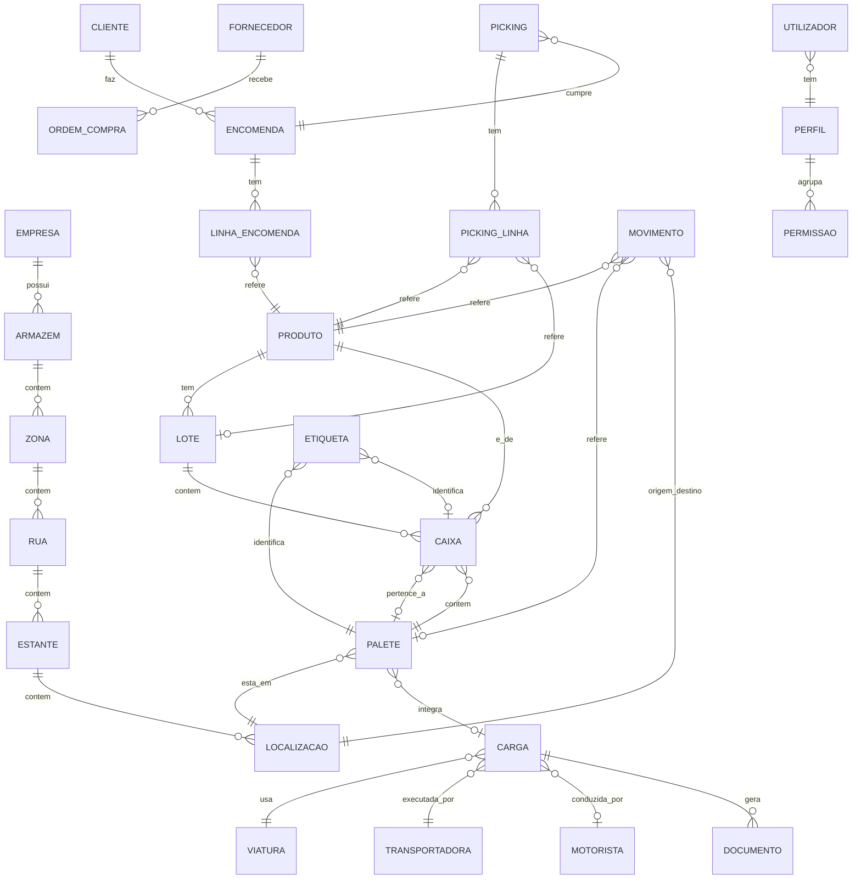
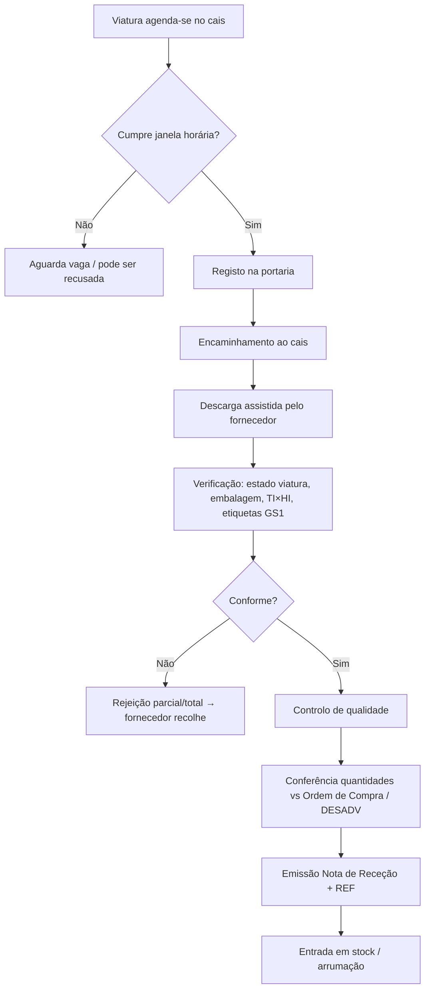
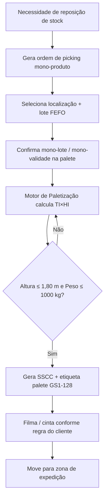
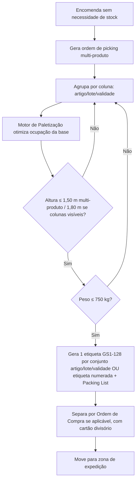
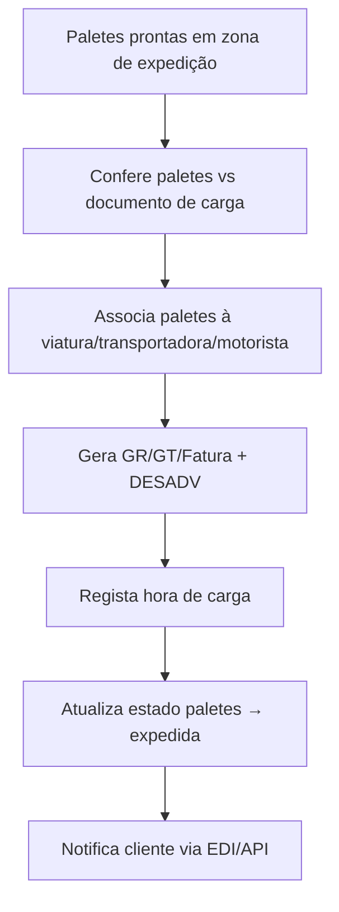
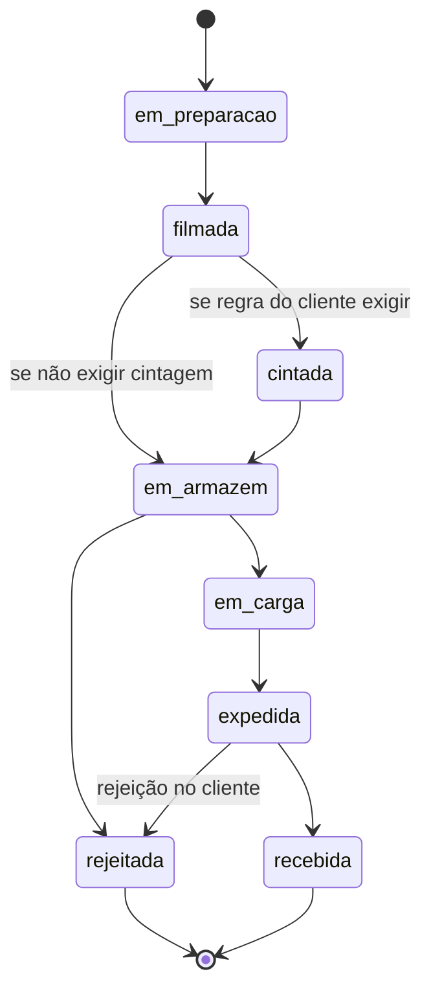
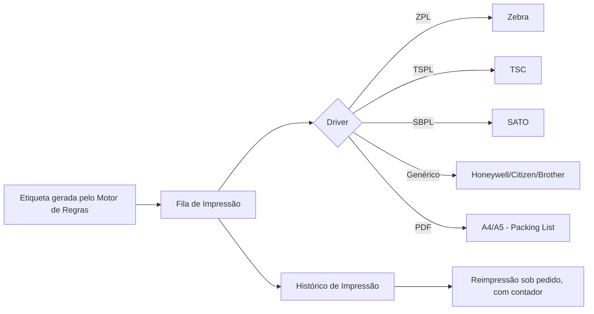
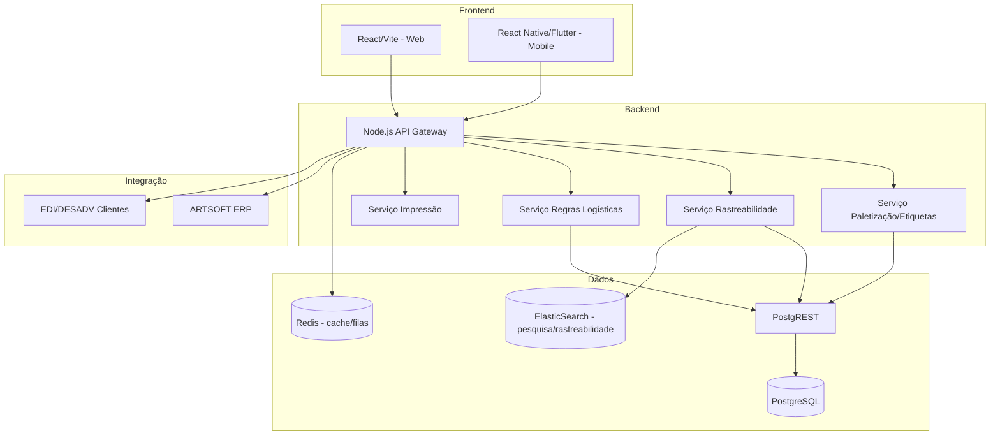

# TicSol Logistics Hub (WMS)
### Documento Funcional e Técnico Oficial — Base de Desenvolvimento do Módulo
**Sistema pai:** TicSol_HuB B2B
**Classificação:** Confidencial — Uso Interno Ticsol Informática, Lda.
**Versão:** 1.0
**Data:** Agosto 2026

---

## Índice

1. [Visão Geral](#1-visão-geral)
2. [Arquitetura Funcional](#2-arquitetura-funcional)
3. [Modelo de Dados](#3-modelo-de-dados)
4. [Fluxos Operacionais](#4-fluxos-operacionais)
5. [Gestão de Paletes](#5-gestão-de-paletes)
6. [Motor Inteligente de Paletização](#6-motor-inteligente-de-paletização)
7. [Gestão de Caixas](#7-gestão-de-caixas)
8. [Rastreabilidade](#8-rastreabilidade)
9. [Motor de Regras Logísticas](#9-motor-de-regras-logísticas)
10. [Designer de Etiquetas](#10-designer-de-etiquetas)
11. [Impressão](#11-impressão)
12. [Aplicação Mobile](#12-aplicação-mobile)
13. [Dashboard](#13-dashboard)
14. [Inteligência Artificial](#14-inteligência-artificial)
15. [Integrações](#15-integrações)
16. [Segurança](#16-segurança)
17. [Arquitetura Técnica](#17-arquitetura-técnica)
18. [Performance](#18-performance)
19. [Roadmap](#19-roadmap)
20. [Entregáveis](#20-entregáveis)
21. [Anexo A — Nota Metodológica sobre a Base de Conhecimento](#anexo-a--nota-metodológica-sobre-a-base-de-conhecimento)

---

## 1. Visão Geral

### 1.1. O que é o TicSol Logistics Hub

O **TicSol Logistics Hub** é o módulo de gestão de armazém (WMS — *Warehouse Management System*) do ecossistema **TicSol_HuB B2B**. Cobre todo o ciclo físico e documental da mercadoria desde a saída da produção/compra até à entrega confirmada no cliente final, com rastreabilidade bidirecional completa (produto → lote → caixa → palete → carga → cliente, e o caminho inverso).

Não é um módulo de picking isolado nem um simples gerador de etiquetas: é a camada operacional que traduz as regras comerciais e logísticas de **cada cliente de distribuição** (Sonae MC, Jerónimo Martins, Lidl, Mercadona, Auchan, Intermarché, Makro, Recheio, El Corte Inglés, ou qualquer operador logístico terceiro) num conjunto de processos, etiquetas e documentos que o armazém executa sem intervenção humana na parametrização.

A base de conhecimento funcional de arranque é o **Caderno de Encargos Logístico da SONAE MC** fornecido, que representa o nível de exigência real do retalho moderno português: agendamento de cais, fluxos PBS/PBL/Cross-Dock, etiquetagem GS1-128/EAN-128, critérios de estiva (TI×HI), packing lists numeradas, regime de rejeições e devoluções com penalização por depósito oneroso. Este documento é tratado como **caso de uso de referência**, não como limite: o sistema tem de ser suficientemente genérico e parametrizável para que outro cliente (Lidl, Mercadona, etc.) seja configurado sem alterar código — apenas dados de configuração.

### 1.2. Objetivos

- Eliminar a dependência de folhas de cálculo, etiquetas manuais e conhecimento tácito de operador para a preparação de expedições.
- Garantir conformidade automática com as especificações GS1-128/EAN-128 de cada cliente de distribuição, incluindo os Identificadores de Aplicação (IA) obrigatórios por fluxo.
- Reduzir rejeições na receção do cliente (a origem mais cara de custo logístico: mercadoria devolvida, cross-docking mal preparado, packing lists incorretas).
- Dar rastreabilidade total, bidirecional e auditável, com tempo de resposta em segundos a uma pergunta "que clientes receberam este lote?" ou "que lotes compõem esta palete?".
- Servir como motor único para múltiplos clientes, múltiplos armazéns e múltiplas empresas do grupo, sem duplicação de lógica.
- Integrar-se nativamente com o ARTSOFT (ERP âncora da Ticsol) e restantes módulos do TicSol_HuB, sem exigir dupla introdução de dados.

### 1.3. Benefícios

| Área | Benefício |
|---|---|
| Operação de armazém | Redução do tempo de preparação por eliminação de retrabalho e reimpressões |
| Compliance | Etiquetagem GS1 correta à primeira, por cliente, sem intervenção manual |
| Financeiro | Menos rejeições/devoluções = menos penalizações e menos custo de transporte duplicado |
| Comercial | Onboarding de novo cliente de distribuição em dias, não meses (motor de regras parametrizável) |
| Auditoria | Rastreabilidade completa para recalls alimentares (Reg. CE 178/2002) e investigação de reclamações |
| Gestão | Visibilidade em tempo real da ocupação, produtividade e SLA de expedição |

### 1.4. Problemas que Resolve

1. **Etiquetagem incorreta ou incompleta** — origem principal de rejeições na receção do cliente (falta de IA obrigatório, SSCC duplicado, posicionamento errado da etiqueta).
2. **Paletização não conforme** — TI×HI errado, altura/peso acima do limite do fluxo (ex.: 1,80 m em PBS mono-produto vs 1,50 m em PBL multi-produto), ausência de separação por lote/validade.
3. **Falta de rastreabilidade** — impossibilidade de responder rapidamente "que caixas deste lote foram para que cliente/loja" em caso de recall.
4. **Dependência de conhecimento tácito** — só um operador "sabe" as regras de um cliente específico; se sai da empresa, o conhecimento perde-se.
5. **Descontinuidade entre sistemas** — ERP, produção e expedição não comunicam, obrigando a reintrodução manual de dados e gerando erros de transcrição.
6. **Custo de not-in-full-not-on-time (NIFOT)** — entregas fora de especificação geram penalização comercial direta.

### 1.5. Comparação com WMS Existentes

| Critério | WMS Genérico (SAP EWM, Infor, Manhattan) | TicSol Logistics Hub |
|---|---|---|
| Custo de licenciamento | Muito elevado, modelo enterprise | Modular, integrado no TicSol_HuB, custo adequado a PME |
| Curva de implementação | Meses a anos, forte dependência de consultoria | Semanas, motor de regras configurável pelo próprio cliente |
| Integração ARTSOFT | Requer middleware customizado dispendioso | Nativa, mesma equipa e stack que já suporta o ERP |
| Parametrização por cliente de distribuição | Normalmente via desenvolvimento | Motor de regras declarativo, sem código |
| Foco geográfico | Genérico internacional | Nascido com o caderno de encargos real do retalho português (GS1 Portugal/CODIPOR) |
| Mobilidade | Módulo separado, frequentemente pago à parte | Nativo desde a Fase 1 |


---

## 2. Arquitetura Funcional

### 2.1. Mapa de Módulos

```
TicSol Logistics Hub
│
├── Dashboard                    (KPIs tempo real, heatmaps, alertas)
├── Receção
│   ├── Agendamento de Cais
│   ├── Conferência ASN/DESADV
│   └── Controlo de Qualidade
├── Armazém
│   ├── Zonas / Ruas / Estantes / Localizações
│   ├── Movimentos Internos
│   └── Reposição
├── Produção → Embalamento       (ligação a Produção do ERP)
├── Paletização
│   ├── Motor Inteligente de Paletização (TI×HI)
│   └── Gestão de Paletes (mono/multi-produto, meias-paletes)
├── Picking
│   ├── PBS (Picking by Store)
│   ├── PBL (Picking by Line)
│   └── Cross-Dock
├── Packing
│   └── Packing List / Numeração
├── Etiquetas
│   ├── Designer (BarTender-like)
│   └── Motor de Regras por Cliente
├── Impressão
│   ├── Filas de Impressão
│   └── Drivers (Zebra, TSC, SATO, Honeywell, Citizen, Brother, PDF)
├── Expedição
│   ├── Carga de Viaturas
│   └── Documentos de Transporte (GR/GT/CMR/DESADV)
├── Transportadoras
├── Clientes / Fornecedores
├── Inventário
│   ├── Contagens Cíclicas
│   └── Ajustes
├── Rastreabilidade
│   └── Consulta bidirecional
├── Devoluções / Rejeições / Quebras
├── Auditoria
│   └── Log imutável de eventos
├── Alertas
├── Configurações
│   ├── Motor de Regras Logísticas
│   └── Parametrização por Cliente/Armazém
├── API
│   └── REST / Webhooks / EDI
└── Aplicação Mobile
```

### 2.2. Descrição Funcional dos Módulos Principais

**Dashboard** — Vista executiva e operacional, com KPIs configuráveis por perfil (gestor de armazém, diretor logístico, operador de cais).

**Receção** — Gestão do agendamento de cais (aplicando a lógica real observada no caderno de encargos: janelas horárias com capacidade máxima de cais e paletes por hora), conferência da ordem de compra contra o documento de entrega (GR/GT/Fatura/DESADV), validação de estiva (TI×HI acordado), controlo de qualidade e emissão de nota de receção.

**Armazém** — Modelo hierárquico Armazém → Zona → Rua → Estante → Localização, com suporte a localizações dinâmicas (picking) e estáticas (reserva), e regras de slotting.

**Paletização** — Ponto onde se aplica o motor de cálculo automático de TI×HI, altura e peso máximos por tipo de fluxo (mono-produto, multi-produto, meia-palete), e geração do SSCC.

**Picking** — Implementa nativamente os três padrões observados no caderno de encargos de referência:
- **PBS (Picking by Store)** — palete mono-produto/mono-lote para stock em entreposto.
- **PBL (Picking by Line)** — palete mono ou multi-produto, sem passar por stock, separada por coluna de artigo/lote/validade.
- **Cross-Dock** — preparação por loja/cliente final, sem stock, com packing list por caixa e por palete.

**Etiquetas / Motor de Regras** — Camada declarativa onde cada cliente de distribuição define os seus próprios requisitos (que Identificadores de Aplicação GS1 usar, onde colocar a etiqueta na palete, exceções para congelados, etc.) sem alteração de código.

**Rastreabilidade** — Índice bidirecional que liga cada evento (receção, movimento, paletização, expedição, devolução) a produto, lote, caixa, palete e documento, com consulta em tempo real.

**Auditoria** — Log imutável (event sourcing parcial) de todas as alterações de estado relevantes: quem, quando, o quê, de onde para onde.


---

## 3. Modelo de Dados

### 3.1. Diagrama Entidade-Relacionamento (visão macro)



### 3.2. Catálogo de Entidades e Campos Principais

#### PRODUTO
| Campo | Tipo | Notas |
|---|---|---|
| id | uuid | PK |
| sku_interno | varchar | Código interno (equivalente a "SKU Sonae" no caderno de encargos) |
| ean13 | varchar(13) | Código de barras da unidade de venda (GS1 Portugal/CODIPOR) |
| gtin_caixa | varchar(14) | GTIN/ITF-14 da caixa (store pack) |
| descricao | varchar | |
| peso_liquido | decimal | Para artigos de peso fixo |
| peso_variavel | boolean | Se aplica variação (±10% por caixa, conforme regra do caderno de encargos) |
| unidades_por_caixa | int | Store pack |
| ti | int | Caixas por camada (base da estiva) |
| hi | int | Camadas por palete (altura da estiva) |
| peso_caixa_max_kg | decimal | Limite regulatório de referência: 20 kg |
| controla_lote | boolean | |
| controla_validade | boolean | |
| requer_temperatura_controlada | boolean | Positiva/negativa |
| categoria | varchar | |
| fornecedor_id | uuid | FK |

#### LOTE
| Campo | Tipo | Notas |
|---|---|---|
| id | uuid | PK |
| produto_id | uuid | FK |
| numero_lote | varchar | |
| data_validade | date | |
| data_producao | date | |
| fornecedor_id | uuid | FK |
| quarentena | boolean | |

#### CAIXA
| Campo | Tipo | Notas |
|---|---|---|
| id | uuid | PK |
| produto_id | uuid | FK |
| lote_id | uuid | FK |
| gtin | varchar(14) | |
| quantidade | decimal | Unidades ou peso, conforme `peso_variavel` |
| peso_real | decimal | Registado à receção/embalamento quando peso variável |
| palete_id | uuid | FK, nullable (pode estar solta em cross-dock) |
| localizacao_id | uuid | FK, nullable |
| estado | enum | `disponivel`, `reservada`, `em_transito`, `rejeitada`, `devolvida` |
| numero_sequencia | varchar | Para cross-dock: "2/3" tipo do caderno de encargos |
| loja_destino_id | uuid | FK, nullable — usado em cross-dock |
| data_criacao | timestamptz | |

#### PALETE
| Campo | Tipo | Notas |
|---|---|---|
| id | uuid | PK |
| sscc | varchar(18) | Chave única global (IA 00) |
| tipo | enum | `europalete`, `meia_palete`, `quarto_palete`, `nao_standard` |
| dimensoes | jsonb | `{comprimento, largura}` mm — ex.: 1200×800 |
| padrao | enum | `mono_produto`, `multi_produto` |
| fluxo | enum | `pbs`, `pbl`, `cross_dock` |
| ti | int | |
| hi | int | |
| altura_mm | int | Validada contra limite do fluxo (1800 mono / 1500 multi) |
| peso_kg | decimal | Validado contra limite do fluxo (1000 kg PBS / 750 kg PBL) |
| estado | enum | `em_preparacao`, `filmada`, `cintada`, `em_armazem`, `em_carga`, `expedida`, `recebida`, `rejeitada` |
| cliente_id | uuid | FK, nullable |
| encomenda_id | uuid | FK, nullable |
| localizacao_id | uuid | FK |
| carga_id | uuid | FK, nullable |
| palete_escrava | boolean | Ver secção 5 |
| operador_id | uuid | FK |
| data_criacao | timestamptz | |
| data_expedicao | timestamptz | nullable |
| data_recepcao_cliente | timestamptz | nullable |
| fotografia_url | varchar | nullable |

#### ETIQUETA
| Campo | Tipo | Notas |
|---|---|---|
| id | uuid | PK |
| tipo | enum | `palete`, `caixa`, `packing_list` |
| palete_id / caixa_id | uuid | FK conforme tipo |
| template_id | uuid | FK para o template usado (Designer) |
| identificadores_aplicacao | jsonb | Array de pares `{ia, valor}` conforme motor de regras (ver secção 9) |
| zpl_gerado | text | Código de impressão gerado |
| data_impressao | timestamptz | |
| reimpressoes | int | Contador |

#### MOVIMENTO
| Campo | Tipo | Notas |
|---|---|---|
| id | uuid | PK |
| tipo | enum | `receção`, `armazenagem`, `picking`, `expedicao`, `transferencia`, `ajuste`, `devolucao` |
| produto_id | uuid | FK |
| palete_id | uuid | FK, nullable |
| caixa_id | uuid | FK, nullable |
| localizacao_origem_id | uuid | FK, nullable |
| localizacao_destino_id | uuid | FK, nullable |
| quantidade | decimal | |
| operador_id | uuid | FK |
| data | timestamptz | |
| documento_id | uuid | FK, nullable |

#### DOCUMENTO
| Campo | Tipo | Notas |
|---|---|---|
| id | uuid | PK |
| tipo | enum | `ordem_compra`, `guia_remessa`, `guia_transporte`, `fatura`, `desadv`, `packing_list`, `nota_recepcao`, `ref` |
| numero | varchar | |
| cliente_id / fornecedor_id | uuid | FK conforme direção |
| carga_id | uuid | FK, nullable |
| conteudo_xml | text | Para DESADV/EDI |
| data_emissao | timestamptz | |

#### Entidades complementares (esquema resumido, mesmo padrão de PK/FK):
`CLIENTE`, `FORNECEDOR`, `ENCOMENDA`, `LINHA_ENCOMENDA`, `ARMAZEM`, `ZONA`, `RUA`, `ESTANTE`, `LOCALIZACAO`, `CARGA`, `VIATURA`, `MOTORISTA`, `TRANSPORTADORA`, `PICKING`, `PICKING_LINHA`, `PACKING_LIST`, `INVENTARIO`, `INVENTARIO_LINHA`, `AUDITORIA` (log imutável append-only), `UTILIZADOR`, `PERFIL`, `PERMISSAO`, `REGRA_LOGISTICA` (motor de regras — ver secção 9), `TEMPLATE_ETIQUETA` (ver secção 10).

### 3.3. Notas de Modelação

- **SSCC como chave de rastreabilidade primária.** Toda a cadeia de custódia (palete → carga → cliente) é indexada por SSCC, não por ID interno, para alinhar com o standard GS1 e permitir troca de dados EDI sem tradução.
- **Multi-tenant desde o desenho.** Todas as tabelas operacionais têm `empresa_id` para suportar multiempresa/multi-armazém sem duplicação de esquema.
- **Caixa como entidade de primeira classe, não apenas atributo da palete** — necessário porque em cross-dock e peso variável a caixa pode existir sem palete-mãe (packing individual) e tem etiquetagem GS1 própria.
- **`REGRA_LOGISTICA`** desenhada como configuração declarativa (JSON/DSL), não como código, para permitir onboarding de novo cliente sem deployment.


---

## 4. Fluxos Operacionais

### 4.1. Receção



### 4.2. Picking by Store (PBS)



### 4.3. Picking by Line (PBL)



### 4.4. Cross-Docking

```mermaid
flowchart TD
    A[Encomenda por loja/cliente final, sem stock] --> B[Prepara por loja em caixas fechadas ou palete dedicada]
    B --> C[Etiqueta caixa: nº loja destino + numeração n/N]
    C --> D[Gera Packing List da loja com artigos/EAN/qtd encomendada/entregue]
    D --> E{Rutura parcial/total?}
    E -- Sim --> F[Anexa quadro-resumo de ruturas por loja/artigo]
    E -- Não --> G[Regista "sem ruturas"]
    F --> H[Gera Packing List da palete: lojas + nº caixas por loja]
    G --> H
    H --> I[Envia DESADV — 1 linha por SSCC, detalhe de artigo/lote/validade dentro]
    I --> J[Carrega palete/caixa na viatura]
```

### 4.5. Expedição / Carga



### 4.6. Outros Fluxos (referência resumida)

- **Armazenagem/Reposição** — seleção de localização por regra de slotting (rotação, peso, categoria), atualização de mapa de ocupação.
- **Inventário** — contagem cíclica por localização ou produto, com ajuste automático de diferenças e registo em `MOVIMENTO` tipo `ajuste`.
- **Devoluções** — reentrada de mercadoria com motivo (comercial/qualidade), gerando nota de crédito associada e, se aplicável, cálculo do depósito oneroso quando o levantamento excede o prazo acordado (o caderno de encargos de referência usa uma taxa diária por palete como penalização por armazenagem não reclamada).
- **Rejeições** — mercadoria não conforme à receção, com prazo de levantamento pelo fornecedor e escalonamento automático se não for cumprido.
- **Quebras** — registo de perdas com motivo (validade expirada, dano, furto) e imputação a centro de custo.


---

## 5. Gestão de Paletes

### 5.1. Atributos por Palete

Cada palete no sistema mantém o conjunto completo de atributos definido no modelo de dados (secção 3.2): SSCC, QR/código GS1, estado, peso, altura, volume, tipo, cliente, destino, transportadora, encomenda, localização, lote, validade, operador, datas (criação/expedição/receção), fotografia e histórico de eventos.

### 5.2. Tipologias Suportadas

| Tipo | Dimensões | Uso típico |
|---|---|---|
| Europalete | 1200 × 800 mm | Standard, base de todo o cálculo de estiva |
| Meia-palete | 600 × 800 mm | Produtos de menor rotação, expositores médios |
| Quarto de palete | 600 × 400 mm | Expositores pequenos, promoções pontuais |
| Não-standard | Variável, sujeita a validação prévia | Artigos com dimensões superiores à europalete |

### 5.3. Padrões de Composição

- **Mono-produto** — uma referência, um lote, uma validade por palete (obrigatório em PBS).
- **Multi-produto** — várias referências separadas por coluna, cada conjunto artigo/lote/validade com a sua própria etiqueta ou numeração de packing list (PBL).
- **Meias-paletes e quartos de palete** — regras próprias de filmagem individual e, no caso de PBS, conjunto de duas meias-paletes sobre uma palete escrava; em PBL a entrega é sem palete escrava.
- **Paletes escravas** — palete física de suporte usada para elevar meias-paletes ou expositores até à altura de manuseamento standard, sem ser ela própria contabilizada como unidade de produto.
- **Paletes sobrepostas** — duas paletes empilhadas fisicamente; exige que as etiquetas de ambas fiquem viradas para o mesmo lado, para leitura sem desmontar a pilha.
- **Pool de paletes / troca / controlo de retornáveis** — o sistema mantém um livro-razão de paletes de aluguer (tipo CHEP/LPR) por cliente/transportadora, contabilizando entradas, saídas e saldo, distinto das paletes fora de sistema de aluguer que não geram obrigação de devolução.

### 5.4. Estados do Ciclo de Vida da Palete




---

## 6. Motor Inteligente de Paletização

### 6.1. Objetivo

Dado um pedido de paletização (produto(s), quantidade, fluxo PBS/PBL/Cross-Dock, cliente), o motor calcula automaticamente a composição ótima da palete e valida-a contra as regras do cliente e as regras físicas gerais, sem intervenção manual.

### 6.2. Variáveis de Entrada

- Dimensões da caixa (comprimento × largura × altura), peso da caixa
- TI (caixas por camada) e HI (camadas por palete) acordados para o produto
- Tipo de palete (europalete/meia/quarto) e fluxo (PBS/PBL/cross-dock)
- Regras do cliente: altura máxima, peso máximo, se admite paletes sobrepostas, se exige palete escrava
- Quantidade a paletizar (da ordem de picking ou da receção)

### 6.3. Algoritmo (visão de alto nível)

```
função calcularPaletizacao(produto, quantidade, fluxo, regrasCliente):
    ti, hi = produto.ti, produto.hi
    caixasPorPalete = ti * hi
    numPaletes = ceil(quantidade / caixasPorPalete)

    para cada palete:
        alturaEstimada = alturaPaleteBase + (hi * alturaCaixa)
        pesoEstimado = hi * ti * pesoCaixa

        limiteAltura = regrasCliente.alturaMaxima(fluxo, padrao)   # ex.: 1800mm mono / 1500mm multi
        limitePeso   = regrasCliente.pesoMaximo(fluxo)             # ex.: 1000kg PBS / 750kg PBL

        se alturaEstimada > limiteAltura:
            reduzirHi()  # recalcula camadas até caber, e regista alerta de sub-otimização
        se pesoEstimado > limitePeso:
            reduzirCaixasPorPalete()

        centroGravidade = calcularCentroGravidade(camadas)
        estabilidade = avaliarEstabilidade(centroGravidade, alturaEstimada, base)

        gerar SSCC único
        gerar sugestão de filme/cintas conforme regrasCliente
        gerar etiquetas necessárias (ver secção 9 — motor de regras)

    retornar planoDePaletizacao
```

### 6.4. Saídas do Motor

- Número de paletes necessárias e composição de cada uma (TI×HI efetivo, camadas)
- Altura, peso e ocupação de base estimados por palete
- Indicação de centro de gravidade e alerta de estabilidade quando aplicável
- Quantidade de filme/cintas necessária (por metro linear, calculado a partir do perímetro × altura)
- Número e tipo de etiquetas a emitir
- SSCC pré-gerados
- Sugestão de otimização quando a última palete fica com ocupação baixa (ex.: "reagrupar com a encomenda seguinte do mesmo cliente")

### 6.5. Evolução Futura — Simulação 3D

Fase posterior (ver Roadmap, secção 19) para bin-packing 3D real com renderização visual da estiva, permitindo ao operador validar visualmente antes de imprimir etiquetas, e alimentar o motor de IA de otimização (secção 14) com dados reais de execução vs. plano.


---

## 7. Gestão de Caixas

### 7.1. Atributos

Conforme modelo de dados (secção 3.2): GTIN, ITF-14, EAN-13, peso, quantidade, validade, lote, fornecedor, cliente, estado, dimensões, tipo de embalagem.

### 7.2. Regras de Integridade Aplicadas

- Cada caixa só pode conter unidades de **um único artigo** — regra herdada diretamente do caderno de encargos de referência e aplicada como constraint de negócio, não apenas convenção.
- Todas as caixas do mesmo artigo têm de ter as mesmas dimensões e quantidades — validado na ficha técnica do produto antes da primeira produção/receção.
- Peso máximo por caixa configurável por cliente (referência de mercado: 20 kg), com bloqueio de emissão de etiqueta se excedido.
- Para artigos de peso variável/médio, o sistema regista o peso real por caixa e valida contra a tolerância definida (referência de mercado: ±10% face ao valor encomendado por caixa/unidade de fornecimento).
- Caixas do tipo *Shelf Ready Package* / tabuleiro têm um atributo `requer_shrink` que condiciona a validação de fecho antes da paletização.

### 7.3. Etiquetagem de Caixa

Cada caixa é identificada com etiqueta própria sempre que:
- O artigo tem peso variável/médio, ou
- A mercadoria não está paletizada (cross-dock caixa a caixa), ou
- O fluxo do cliente assim o exigir mesmo com palete mono-produto.

O padrão de duas etiquetas por caixa (mesma informação, faces opostas ou grampos de caixa plástica RPC) é suportado nativamente como opção configurável por cliente/artigo.


---

## 8. Rastreabilidade

### 8.1. Cadeia de Custódia

```
Produto → Lote → Caixa → Palete → Carga → Viatura → Cliente → Receção → (Consumidor, se aplicável)
```

Cada seta representa um `MOVIMENTO` ou associação registada de forma imutável. A consulta de rastreabilidade percorre este grafo em ambos os sentidos:

- **Forward (para a frente):** "Este lote X foi para que clientes/lojas, em que cargas, em que datas?" — essencial para recall de produto (enquadramento no Regulamento (CE) n.º 178/2002 sobre segurança alimentar, referido no caderno de encargos de origem).
- **Backward (para trás):** "Esta palete/SSCC recebida pelo cliente contém que lotes/produtos/fornecedores?"

### 8.2. Implementação

- Tabela `MOVIMENTO` como *append-only ledger*: nunca se edita um movimento, apenas se cria um novo movimento de correção referenciando o original.
- Índices por `sscc`, `numero_lote` e `produto_id` para consulta em milissegundos mesmo com histórico de milhões de registos (ver secção 18 — Performance).
- Vista materializada `rastreabilidade_grafo` recalculada incrementalmente, para não obrigar a percorrer toda a árvore de movimentos em cada consulta.
- API dedicada `GET /rastreabilidade/lote/{numero_lote}` e `GET /rastreabilidade/sscc/{sscc}` devolvendo a árvore completa em JSON.

### 8.3. Caso de Uso — Recall

1. Deteta-se um problema de qualidade associado a um lote.
2. Operador consulta `numero_lote` → sistema devolve todas as caixas, paletes, cargas e clientes/lojas de destino.
3. Sistema gera automaticamente lista de contactos a notificar (clientes) e sugestão de devolução em massa.
4. Todo o processo fica registado em auditoria (secção 16) com timestamp e utilizador.


---

## 9. Motor de Regras Logísticas

### 9.1. Princípio

Nenhuma regra específica de cliente vive em código. Todas vivem em configuração declarativa (`REGRA_LOGISTICA`), avaliada em tempo de execução pelo motor de paletização, etiquetagem e impressão. Isto é o que torna possível o objetivo central do módulo: onboarding de um novo cliente de distribuição (Lidl, Mercadona, Auchan, etc.) sem uma única linha de código nova.

### 9.2. Estrutura de uma Regra

```json
{
  "cliente_id": "sonae-mc",
  "fluxo": "pbs",
  "condicoes": {
    "categoria_produto": "congelados"
  },
  "efeitos": {
    "etiqueta_palete": {
      "identificadores_aplicacao": ["00", "02", "37", "10", "15", "3102"],
      "posicao": "topo_direita_lado_esquerdo",
      "altura_colocacao_mm": { "min": 400, "max": 800 },
      "requer_filme": true,
      "requer_cintagem": false
    },
    "paletizacao": {
      "altura_maxima_mm": 1800,
      "peso_maximo_kg": 1000,
      "mono_produto_obrigatorio": true
    }
  }
}
```

### 9.3. Exemplos de Aplicação

```
Se Cliente = Sonae MC E Fluxo = PBS
  → altura máxima 1800mm, peso máximo 1000kg, mono-produto obrigatório
  → etiqueta GS1-128 com IA (00)(02)(37)(10)(15)(3102), 2 etiquetas por palete

Se Cliente = Sonae MC E Fluxo = PBL E Padrão = multi-produto
  → altura máxima 1500mm, peso máximo 750kg
  → etiqueta por conjunto artigo/lote/validade OU etiqueta numerada + Packing List

Se Cliente = Sonae MC E Categoria = Congelados
  → posição da etiqueta: topo, lado esquerdo (exceção à regra geral de lado direito)

Se Cliente = Lidl
  → usa layout de etiqueta próprio Lidl (template configurado no Designer, secção 10)

Se Cliente = Mercadona
  → usa layout de etiqueta próprio Mercadona + idioma espanhol nos campos de texto livre
```

### 9.4. Motor de Avaliação

O motor resolve regras por ordem de especificidade (cliente + fluxo + categoria > cliente + fluxo > cliente > default global), permitindo exceções pontuais (como a dos congelados acima) sem reescrever a regra geral. Cada avaliação de regra fica registada como parte do histórico da etiqueta gerada, para auditoria de "porque é que esta etiqueta ficou assim".

### 9.5. Interface de Configuração

Ecrã dedicado nas Configurações onde um utilizador de negócio (não programador) define regras por cliente através de formulário estruturado, com pré-visualização imediata da etiqueta resultante (ligação direta ao Designer de Etiquetas, secção 10).


---

## 10. Designer de Etiquetas

### 10.1. Conceito

Editor visual (drag-and-drop) semelhante ao BarTender, para definição de templates de etiqueta sem programação. Cada template é depois associado a uma ou mais regras logísticas (secção 9).

### 10.2. Campos Dinâmicos Suportados

QR Code, código GS1-128/EAN-128 (com Identificadores de Aplicação selecionáveis), EAN-13, código de barras genérico (Code128, ITF-14), SSCC, lote, validade, peso, GTIN, transportadora, destino, logótipo, nome/dados do cliente, texto livre, imagens/logotipos, pictogramas de manuseamento (frágil, sentido correto, etc. — referência direta aos logótipos de manuseamento observados no caderno de encargos).

### 10.3. Estrutura do Template (dados)

```json
{
  "template_id": "sonae-palete-pbs-v1",
  "dimensoes_mm": { "largura": 148, "altura": 210 },
  "elementos": [
    { "tipo": "texto", "campo": "nome_fornecedor", "posicao": [10, 10], "fonte": "Arial 10 Bold" },
    { "tipo": "texto_livre", "conteudo": "morada/logotipo", "posicao": [10, 25] },
    { "tipo": "barcode_gs1_128", "identificadores": ["00","02","37","10","15","3102"], "posicao": [10, 60] },
    { "tipo": "texto", "campo": "numero_ordem_compra", "posicao": [10, 190] }
  ]
}
```

### 10.4. Templates Ilimitados

Cada cliente pode ter N templates (por fluxo, por categoria de produto, por exceção sazonal), sem limite técnico — o limite é apenas organizacional (nomeação e versionamento de templates).


---

## 11. Impressão

### 11.1. Suporte de Impressoras

Zebra (ZPL II), Honeywell (Fingerprint/ZPL emulado), TSC (TSPL), SATO (SBPL), Citizen, Brother (etiquetas de menor formato), além de saída genérica PDF para impressão A4/A5 (Packing Lists e documentos de acompanhamento).

### 11.2. Arquitetura de Impressão



### 11.3. Funcionalidades

- Impressão automática disparada por evento (ex.: palete concluída no motor de paletização).
- Reimpressão controlada, com registo de motivo e contador de reimpressões por etiqueta (relevante para auditoria — evita reimpressão descontrolada de SSCC que já circulou).
- Suporte a impressão em lote (ex.: todas as etiquetas de uma carga).
- Fila com prioridade configurável (ex.: cross-dock com hora de carga marcada tem prioridade sobre reposição de armazém).


---

## 12. Aplicação Mobile

### 12.1. Plataformas

Android e iOS (React Native ou Flutter — decisão técnica na secção 17), com suporte a PDA industrial (Zebra/Honeywell) via SDK nativo para leitura de código de barras a laser, mantendo compatibilidade com o mesmo binário usado em smartphones de consumo.

### 12.2. Funcionalidades

Receção, picking (PBS/PBL/cross-dock, com scan orientado passo-a-passo), packing, carga, descarga, inventário (contagem cíclica), movimentos internos, captura de fotografia (evidência de estado da mercadoria/danos), captura de assinatura (confirmação de entrega/receção), scanner por câmara (fallback) e scanner laser (PDA dedicado).

### 12.3. Modo Offline

- Fila de operações local (SQLite/IndexedDB conforme plataforma) quando sem rede.
- Sincronização automática ao reconectar, com resolução de conflitos por timestamp e por prioridade de operação (movimentos físicos têm prioridade sobre atualizações de metadados).
- Indicador visual permanente de estado de sincronização, para o operador nunca assumir que uma operação já está confirmada no servidor quando não está.


---

## 13. Dashboard

### 13.1. KPIs em Tempo Real

Paletes produzidas/expedidas/em preparação, taxa de ocupação de armazém, produtividade de picking (linhas/hora, paletes/hora por operador), tempo médio de ciclo (receção → expedição), número de receções e expedições do dia, alertas ativos, rupturas de stock, SLA de agendamento cumprido vs. incumprido.

### 13.2. Visualizações

- Mapa do armazém com ocupação por zona (heatmap de densidade).
- Heatmap de atividade de picking (zonas mais/menos percorridas — input direto para otimização de slotting).
- Funil de expedição (paletes em preparação → prontas → carregadas → expedidas).
- Painel de rejeições/devoluções por cliente e por motivo, para deteção de padrões recorrentes.

### 13.3. Perfis de Consulta

Dashboard adaptado por perfil: operador de armazém vê a sua fila de tarefas; gestor de armazém vê ocupação e produtividade; direção logística vê SLA por cliente e custos de não-conformidade.


---

## 14. Inteligência Artificial

Funcionalidades propostas para fases futuras (ligadas ao Roadmap, secção 19, Fase 5):

- **Otimização da estiva** — modelo treinado sobre histórico real de execução (não apenas o cálculo determinístico do motor da secção 6), aprendendo padrões de estabilidade por tipo de embalagem.
- **Otimização de picking** — sequenciamento de rotas de picking para minimizar deslocação, com aprendizagem contínua a partir do heatmap de atividade (secção 13).
- **Previsão de ocupação** — modelo de séries temporais para antecipar picos de ocupação de armazém e sugerir reforço de equipa/turnos.
- **Deteção de erros** — deteção de anomalias em tempo real (ex.: peso de caixa fora do padrão histórico do artigo, indicando possível erro de picking antes da expedição).
- **Sugestão automática de localização (slotting)** — recomendação de localização de arrumação com base em rotação, afinidade de picking e regras de segregação (ex.: alimentar vs. não-alimentar).
- **Análise de produtividade** — deteção de desvios de produtividade por operador/turno, com foco em identificar necessidades de formação, não em vigilância punitiva.
- **Assistente IA / chat interno** — interface conversacional para consultas operacionais ("quantas paletes do cliente X estão prontas para hoje?"), integrada com o motor de rastreabilidade (secção 8).


---

## 15. Integrações

### 15.1. Integração ERP (ARTSOFT)

Ponto crítico: o TicSol Logistics Hub não duplica dados mestre. Produto, Cliente, Fornecedor e Ordem de Compra vivem no ARTSOFT e são sincronizados (não recriados) para o Logistics Hub, com o Logistics Hub a devolver eventos de stock e expedição para atualização do ERP. Reaproveita-se a integração ARTSOFT já existente noutros pontos do TicSol_HuB (FTP/Chilkat, sync de tabelas como `DOCFCH`), estendendo-a com os novos eventos logísticos.

### 15.2. Outras Integrações

| Sistema | Direção | Protocolo |
|---|---|---|
| Produção | Entrada (ordens de produção → embalamento) | REST interno |
| Compras | Entrada (ordens de compra → receção esperada) | REST interno / sync ARTSOFT |
| Vendas | Entrada (encomendas → picking) | REST interno / sync ARTSOFT |
| CRM | Saída (eventos de entrega/rejeição) | Webhook |
| B2B (clientes de distribuição) | Bidirecional | EDI / API REST |
| EDI — DESADV / ASN | Saída | XML conforme especificação SONAE/GS1 ou standard do cliente |
| GS1 | Referência de standard | GS1-128, EAN-128, ITF-14, SSCC |

### 15.3. Padrões Técnicos Disponibilizados

REST API (documentada via OpenAPI), GraphQL para consultas complexas de rastreabilidade, Webhooks para eventos assíncronos (palete expedida, receção confirmada pelo cliente), e suporte a filas de mensagens (MQTT para telemetria de dispositivos móveis/PDA, RabbitMQ ou Azure Service Bus para desacoplamento entre microserviços — ver secção 17).


---

## 16. Segurança

### 16.1. Autenticação e Autorização

OAuth2 / OIDC como base, JWT de curta duração para sessões de API, MFA obrigatório para perfis administrativos e para acesso a funcionalidades de correção/estorno de movimentos. Perfis e permissões granulares por módulo e por ação (ler/criar/editar/aprovar), com suporte nativo a multiempresa (isolamento estrito de dados entre empresas do grupo).

### 16.2. Auditoria

Log imutável (append-only) de todas as ações relevantes: quem, quando, o quê, valor anterior/novo. Este log é a base tanto para investigação interna como para resposta a auditorias externas (ex.: rastreabilidade alimentar).

### 16.3. Conformidade

RGPD (dados de motoristas, operadores, contactos de clientes/fornecedores — minimização e retenção definida por política), preparação para alinhamento com boas práticas ISO 27001 (gestão de acessos, cifragem em trânsito e em repouso, segregação de ambientes).


---

## 17. Arquitetura Técnica

### 17.1. Alinhamento com o Stack Atual do TicSol_HuB

O TicSol_HuB Central já assenta em **React/Vite (frontend) → Backend Node.js → PostgREST → PostgreSQL**. O Logistics Hub é desenhado como **módulo adicional dentro desta mesma arquitetura**, não como sistema paralelo — isto reduz drasticamente o custo de manutenção e reaproveita autenticação, autorização e infraestrutura já existentes.



### 17.2. Padrões de Arquitetura Aplicados

- **DDD (Domain-Driven Design)** — bounded contexts claros: Receção, Paletização, Picking, Etiquetagem, Rastreabilidade, Regras Logísticas. Cada contexto tem a sua própria linguagem ubíqua (ex.: "SSCC", "TI×HI", "packing list numerada") sem vazamento de conceitos entre contextos.
- **CQRS parcial** — separação de modelo de escrita (movimentos, eventos) e modelo de leitura (vistas materializadas para dashboard e rastreabilidade), justificada apenas onde o volume o exige (rastreabilidade e dashboard), não aplicada indiscriminadamente a todo o sistema — evita complexidade desnecessária num módulo que ainda vai arrancar em escala PME.
- **Event Sourcing parcial** — aplicado apenas à tabela `MOVIMENTO` e `AUDITORIA` (append-only), não ao sistema inteiro. É o suficiente para dar rastreabilidade e auditoria completas sem o custo de reconstrução de estado a partir de eventos em todas as entidades.
- **Clean Architecture / SOLID** — camadas de domínio isoladas de infraestrutura, permitindo trocar PostgREST por outra camada de acesso a dados no futuro sem reescrever regras de negócio.
- **Microserviços moderados** — não um microserviço por entidade (over-engineering para esta escala), mas separação por bounded context com maior probabilidade de escalar de forma independente: Paletização/Etiquetas (CPU-bound, cálculo), Rastreabilidade (I/O-bound, consulta), Impressão (integração com hardware).

### 17.3. Stack Tecnológico Proposto

| Camada | Tecnologia |
|---|---|
| Frontend Web | React + Vite |
| Frontend Mobile | React Native (reaproveita conhecimento React da equipa) |
| API Gateway/Backend | Node.js (Express/Fastify) |
| Acesso a dados | PostgREST sobre PostgreSQL |
| Cache/Filas leves | Redis |
| Pesquisa/Rastreabilidade | ElasticSearch (opcional, a partir do volume que justifique) |
| Mensageria assíncrona | RabbitMQ (on-premise) ou Azure Service Bus (cloud) |
| Tempo real (dashboard) | SignalR ou WebSockets nativos |
| Contentorização | Docker / Docker Compose (dev), Kubernetes (produção a partir da Fase 4) |
| Cloud (opcional) | Azure — alinhado com o guia de deployment já elaborado para o TicSol_HuB (App Service + PostgreSQL Flexible Server + Container Apps + Azure Functions para sync ARTSOFT) |

### 17.4. API Gateway e Contratos

Toda a comunicação frontend/mobile → backend passa por um API Gateway único, que aplica autenticação, rate limiting e versionamento de contrato (OpenAPI). Os microserviços internos comunicam entre si por eventos (fila) sempre que a operação não exige resposta síncrona (ex.: geração de etiqueta após confirmação de paletização), e por chamada direta apenas quando a resposta é bloqueante para o utilizador (ex.: cálculo de TI×HI em tempo real no ecrã de picking).


---

## 18. Performance

### 18.1. Desafios de Escala

Milhões de movimentos, etiquetas, SSCC e caixas ao longo do tempo — o desenho tem de assumir desde o início que a tabela `MOVIMENTO` cresce indefinidamente e não pode ser o caminho de leitura principal do dashboard ou da rastreabilidade em tempo real.

### 18.2. Estratégias

- **Particionamento de tabelas históricas** (`MOVIMENTO`, `AUDITORIA`) por data (partição mensal em PostgreSQL), mantendo consultas recentes rápidas e permitindo arquivamento/purga de partições antigas sem downtime.
- **Vistas materializadas** para dashboard e rastreabilidade, recalculadas de forma incremental (trigger ou job agendado), evitando `JOIN` pesados em tempo real.
- **Índices dedicados** por `sscc`, `numero_lote`, `produto_id`, `data` — cobrindo os padrões de consulta reais da rastreabilidade (secção 8).
- **Cache Redis** para consultas de configuração/regras logísticas (secção 9), que mudam pouco mas são lidas em cada operação de etiquetagem.
- **Filas assíncronas** para operações não bloqueantes (impressão, notificação EDI), evitando que picos de carga na expedição bloqueiem o picking.
- **Baixa latência no ecrã de picking mobile** — cálculo de TI×HI e validação de regras acontece no backend mas com resposta alvo sub-segundo; pré-cálculo de regras aplicáveis ao carregar a ordem de picking, não a cada scan.
- **Alta concorrência** — múltiplos operadores a paletizar em simultâneo no mesmo armazém exigem locks otimistas ao nível da localização/palete (não locks pessimistas de tabela), com resolução de conflito ao nível da aplicação.


---

## 19. Roadmap

| Fase | Objetivos | Complexidade | Tempo Estimado | Benefícios | Dependências |
|---|---|---|---|---|---|
| **Fase 1 — Core Logístico** | Modelo de dados base, Receção, Armazém, Clientes/Fornecedores, integração inicial ARTSOFT (produto/cliente/fornecedor), Auditoria | Média | 6–8 semanas | Substitui folhas de cálculo; base de dados única de rastreabilidade arranca desde já | Sync ARTSOFT (produto/cliente) disponível |
| **Fase 2 — Paletização** | Gestão de Paletes, Motor Inteligente de Paletização (TI×HI), SSCC, Designer de Etiquetas, Motor de Regras (v1, 1 cliente) | Alta | 6–8 semanas | Etiquetagem GS1-128 correta à primeira para o primeiro cliente de distribuição onboarded | Fase 1 concluída |
| **Fase 3 — Picking** | PBS, PBL, Cross-Dock, Packing List (incl. numerada), Impressão (Zebra/PDF) | Alta | 8–10 semanas | Cobertura completa dos 3 fluxos de picking do mercado de retalho português | Fase 2 concluída |
| **Fase 4 — WMS Completo** | Expedição, Transportadoras, Inventário, Devoluções/Rejeições/Quebras, Dashboard, App Mobile (receção/picking/packing) | Alta | 10–12 semanas | Ciclo logístico fim-a-fim operacional em armazém real | Fase 3 concluída |
| **Fase 5 — IA** | Otimização de picking, deteção de anomalias, previsão de ocupação, assistente conversacional | Alta | 8–12 semanas | Ganhos de produtividade incrementais sobre base já estável | Fase 4 com histórico de dados suficiente |
| **Fase 6 — RFID** | Suporte a leitura RFID em receção/expedição/inventário como alternativa/complemento a código de barras | Média-Alta | 6–8 semanas | Redução de tempo de contagem de inventário e de conferência de carga | Fase 4 concluída; decisão de investimento em hardware RFID |
| **Fase 7 — Digital Twin** | Réplica digital do armazém (localização em tempo real, simulação de cenários de slotting) | Muito Alta | 12+ semanas | Simulação de mudanças de layout sem risco operacional | Fase 6 concluída; maturidade de dados de localização |

### 19.1. Nota sobre Estimativas

As estimativas de tempo assumem equipa dedicada de 2–3 developers full-stack com o perfil já existente na Ticsol (Node.js, SQL, PowerShell/automação) mais um recurso de UX/mobile a partir da Fase 4. Fases 5–7 são deliberadamente mantidas como visão de médio prazo e não como compromisso de calendário fechado.


---

## 20. Entregáveis

Este documento constitui, em conjunto, os seguintes entregáveis, referenciados por secção:

| Entregável | Secção(ões) de referência |
|---|---|
| Documento Funcional | 1, 4, 5, 7, 12, 13 |
| Documento Técnico | 17, 18 |
| Modelo de Dados | 3 |
| Casos de Uso | 4, 8.3, 9.3 |
| Requisitos Funcionais (RF) | 1.2, 4, 5, 6, 7, 9, 10, 11 |
| Requisitos Não Funcionais (RNF) | 16, 18 |
| Diagramas UML/BPMN (fluxogramas) | 4 |
| Diagrama de Classes / ER | 3.1 |
| Arquitetura de Microserviços | 17.1, 17.4 |
| Arquitetura DDD | 17.2 |
| APIs | 15.3, 17.4 |
| Eventos | 8.2, 17.2 |
| Estrutura das Bases de Dados / Tabelas | 3.2 |
| Estratégias de Cache | 18.2 |
| Estratégias de Escalabilidade | 17.2, 18 |
| Plano de Implementação (Roadmap) | 19 |
| Manual Técnico (base) | 17 |
| Manual Funcional (base) | 1, 2 |

Os entregáveis assinalados como "base" (Manual Técnico, Manual Funcional, Guia do Utilizador, Plano de Testes, Plano de Migração) requerem elaboração dedicada após o fecho de cada fase do Roadmap, uma vez que dependem de decisões de implementação que só se tornam concretas durante o desenvolvimento (nomes de endpoints finais, ecrãs reais construídos, dados de migração específicos do cliente). Este documento fornece a base de arquitetura e requisitos sobre a qual esses entregáveis operacionais serão escritos.

---

## Anexo A — Nota Metodológica sobre a Base de Conhecimento

Este documento foi construído tendo como referência funcional o **Caderno de Encargos Logístico** fornecido (documento de especificação de fornecedores da SONAE MC, 41 páginas, incluindo standards de agendamento, documentação, critérios de paletização, GS1-128/EAN-128, fluxos PBS/PBL/Cross-Docking e anexos de moradas de entrepostos, tipologia de paletes e especificação de packing list).

Esse caderno de encargos foi tratado como **caso de uso real e exigente do mercado de retalho português**, não como especificação a implementar literalmente. As regras específicas nele contidas (ex.: capacidade de cais, taxas de depósito oneroso, moradas de entrepostos) são de um cliente de distribuição concreto e não devem ser codificadas como valores fixos no sistema — o **Motor de Regras Logísticas** (secção 9) foi desenhado precisamente para que estas e outras regras equivalentes de qualquer cliente (Lidl, Mercadona, Auchan, Intermarché, Makro, Recheio, El Corte Inglés, Jerónimo Martins, ou operadores logísticos terceiros) sejam configuração, não código.

**Melhorias propostas face ao documento de origem:**
- Rastreabilidade bidirecional nativa e pesquisável (o documento de origem define os dados a capturar, mas não um sistema de consulta rápida sobre eles).
- Motor de regras declarativo por cliente, permitindo múltiplos "cadernos de encargos" simultâneos sem duplicação de sistema.
- Motor de paletização com sugestão de otimização automática (o documento de origem define os limites, mas o cálculo de composição ótima fica a cargo do sistema).
- App mobile com modo offline, cobrindo o cenário real de armazéns com zonas de fraca cobertura de rede.
- Dashboard e alertas em tempo real, ausentes do documento de origem (que é puramente normativo/contratual).

